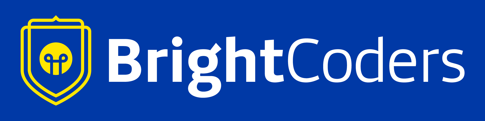

# Nombre del proyecto
Definan un nombre para su proyecto

## Problematica que atiende
Describan la problemática que pretenden atender con su proyecto

## Propuesta de solución
Describan de manera general las características de tu propuesta así como la forma en que atiende o resuelve la problemática que definieron.

## Definición de requerimientos del MVP

### Requerimientos funcionales

### Requerimientos no funcionales

## Diseño del MVP

Incluyan en [esta carpeta](/design) su propuesta de diseño

## Recursos

- [Minimum Viable Product](https://www.agilealliance.org/glossary/mvp/#q=~(infinite~false~filters~(tags~(~'mvp))~searchTerm~'~sort~false~sortDirection~'asc~page~1))
- [Minimum Viable Product (MVP)](https://www.productplan.com/glossary/minimum-viable-product/)
- [Design Thinking](https://www.interaction-design.org/literature/topics/design-thinking)
- [El proceso de pensamiento de diseño](https://www.youtube.com/watch?v=_r0VX-aU_T8)
- [Metodología Design Thinking. Ejemplos](https://www.youtube.com/watch?v=_ul3wfKss58) 
- [Design Thinking ejemplo sencillo](https://www.youtube.com/watch?v=_H33tA2-j0s)
